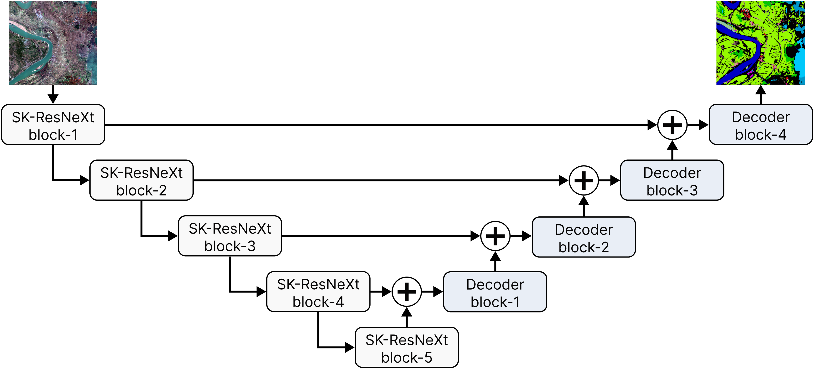

# SKUNet: Leveraging U-Net and Selective Feature Extraction for Land Cover Classification Using Remote Sensing Imagery

<div align="center">

[Leo Thomas Ramos](https://www.linkedin.com/in/leo-thomas-ramos/), [Angel D. Sappa](https://es.linkedin.com/in/angel-d-sappa-61532b17)<br/>
Correspondence: ltramos@cvc.uab.cat

Computer Vision Center (CVC), Universitat Autònoma de Barcelona (UAB), Spain

</div>

<div align="center">

</div>

## Announcements

- Official implementation and model code are available
- The SKUNet paper is available in [here](https://doi.org/10.1038/s41598-024-84795-1)
- SKUNet has been accepted in Scientific Reports

## About the project

SKUNet is a U-Net-based semantic segmentation model for land-cover classification using multispectral remote sensing imagery. It enhances the conventional U-Net architecture with a **Selective Kernel ResNeXt50** encoder, combining the multi-path representation capacity of ResNeXt with adaptive receptive fields that dynamically capture features at different spatial scales. This design improves multiscale feature extraction while preserving the spatial reconstruction capabilities of the U-Net decoder. The model supports multiband inputs and is evaluated on the Five-Billion-Pixels dataset, which contains 24 land-cover classes on RGB, RG-NIR, and RGB-NIR configurations.


## Installation

```bash
pip install -r requirements.txt
```

## Quick usage

SKUNet can be instantiated directly from `skunet.py` and integrated into any training workflow:

```python
from skunet import SKUNet

model = SKUNet(
    in_channels=4,
    num_classes=24,
)
```

## Input and output

- **Input:** tensor of shape `(B, in_channels, H, W)`
- **Output:** logits of shape `(B, num_classes, H, W)`

Example forward pass:

```python
import torch
from skunet import SKUNet

model = SKUNet(in_channels=4, num_classes=24)
x = torch.randn(2, 4, 256, 256)
y = model(x)
print(y.shape)  # (2, 24, 256, 256)
```

## Dataset

SKUNet is evaluated on the [Five-Billion-Pixels dataset](https://x-ytong.github.io/project/Five-Billion-Pixels.html), a large-scale land-cover classification benchmark containing:

- 150 high-resolution Gaofen-2 satellite images
- More than 5 billion annotated pixels
- 24 land-cover classes
- Four spectral bands: blue, green, red, and near-infrared
- 4 m spatial resolution

The original large tiles are cropped into non-overlapping `256 x 256` patches. The model is evaluated using three band configurations:

- **RGB**
- **RG-NIR**
- **RGB-NIR**

## Main results

| Model | Band combination | OA (%) | mIoU (%) | Training time (h) | Inference time (s) |
|------|------|------:|------:|------:|------:|
| **SKUNet** | **RGB** | **79.010** | **53.161** | 4.129 | 0.010 |
| **SKUNet** | **RG-NIR** | **79.533** | **53.255** | 4.066 | 0.010 |
| **SKUNet** | **RGB-NIR** | **80.561** | **54.394** | **4.283** | **0.011** |
| U-Net | RGB | 75.025 | 48.814 | 3.602 | 0.003 |
| U-Net | RG-NIR | 74.380 | 49.800 | 3.890 | 0.003 |
| U-Net | RGB-NIR | 76.106 | 50.461 | 4.465 | 0.003 |
| DeepLabV3+ | RGB-NIR | 79.970 | 54.008 | 3.473 | 0.006 |
| DeepLabV3 | RGB | 79.940 | 54.106 | 4.308 | 0.006 |
| SegFormer | RGB-NIR | 72.794 | 44.264 | 2.976 | 0.013 |

## Why SKUNet

- SK-ResNeXt50 encoder with adaptive multi-scale feature extraction.
- U-Net decoder with spatial skip connections for precise reconstruction.
- Support for RGB and multispectral input configurations.
- Pretrained encoder for stronger feature initialization.
- Competitive accuracy on a large-scale, 24-class land-cover benchmark.

## Citation

If you find this work useful, please star ⭐️⭐️⭐️ our repository and cite our paper:

```bibtex
@article{ramos2025leveraging,
    title = {Leveraging U-Net and selective feature extraction for land cover classification using remote sensing imagery},
    volume = {15},
    number = {1},
    journal = {Scientific Reports},
    author = {Ramos, Leo Thomas and Sappa, Angel D.},
    year = {2025},
    pages = {784},
    doi = {10.1038/s41598-024-84795-1}
}
```

## License

Distributed under the GNU General Public License v3.0. See `LICENSE` for more information.
